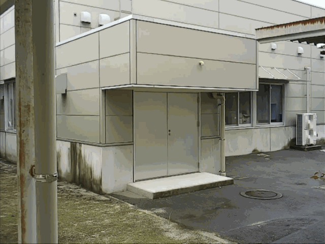
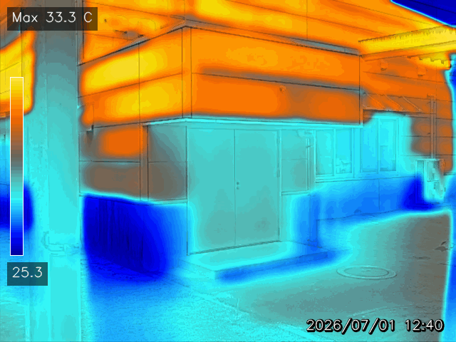
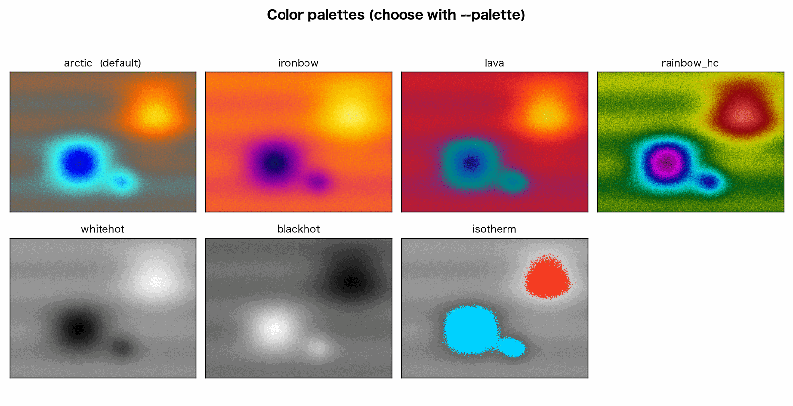

# hikmicropy

[日本語](README.md) ・ **English**

A Python package that extracts per-pixel temperature data from HIKMICRO Pocket2 radiometric
JPEG files and produces detail-fused images and interactive temperature maps.

A `HM****.jpeg` saved by the HIKMICRO Pocket2 embeds a per-pixel raw sensor array (radiometric
data) in addition to the display image. The raw values are not temperatures on their own, so the
tool extracts them and calibrates to degrees Celsius using the temperature scale bar burned into
the photo. The intended use is detecting relatively cold regions on surfaces (e.g. moisture from
water leaks).

## Example output

`process` **produces the visible image and the fusion image as a pair**. The fusion image overlays
the visible edges on the thermal color map, so structure and temperature can be read together.
**Unlike the camera's own export, the output images carry no HIKMICRO logo.**

| Visible (aligned to the IR frame) | Fusion (thermal color + structural edges) |
|---|---|
|  |  |

The Max/Min scale bar is shown top-left and the capture time bottom-right. Structural edges come
from the visible image; the thermal hue (temperature) is preserved.

## Features

- Extract the **raw sensor array (256×192 `uint16`)** from the radiometric JPEG.
- Convert to °C with an **image-specific two-point linear calibration** from the scale bar.
- Align the visible image to the IR frame (scale + translation only, no rotation) and **fuse the
  structural edges**.
- **Output the visible and fusion images together** (fusion requires the visible image).
- **Selectable color palettes** (default `arctic`, which renders cold/damp areas in blue).
- Export an **interactive HTML (Plotly) using the fusion image as the background**, where
  **hovering over any point reports that pixel's estimated temperature and raw value**.
- Record processing metadata (calibration provenance, OCR agreement) as JSON.
- Produce output images **without any manufacturer logo**.

## Color palettes

Select with `--palette`. The default `arctic` best highlights cold (damp) regions.



## Installation

All dependencies are common to Windows, macOS, and Linux; **no platform-specific environment file
is required.**

### conda

```bash
conda env create -f environment.yml   # same file on all three OSes
conda activate hikmicropy
pip install -e .
```

### pip

```bash
pip install -e .            # core
pip install -e ".[viz]"     # + matplotlib (optional, for HikmicroExtractor.plot)
```

### Tesseract (only if using OCR, optional)

The Tesseract binary is needed only to read the scale bar by OCR.

| OS | Install |
|---|---|
| Windows | `conda install -c conda-forge tesseract`, or the UB Mannheim installer |
| macOS | `brew install tesseract` |
| Linux | `apt install tesseract-ocr`, etc. |

OCR is optional. Temperatures can be supplied with `--tmin/--tmax`, which is recommended for
quantitative work.

## Usage

```bash
# One IR/VIS pair (writes fusion, visible, metadata, and HTML)
hikmicropy process IR.jpeg IR.VIS.jpeg --palette arctic --out-dir output --html

# Batch a folder (auto-pairs HM*.jpeg with HM*.VIS.jpeg)
hikmicropy batch ./photos --palette arctic --out-dir output --html

# CSV / HTML from a single IR image (no VIS; fusion is not produced)
hikmicropy export IR.jpeg --tmin 31.4 --tmax 33.8 --csv --html
```

`process` writes `*_fusion.png`, `*_visible.png`, and `*_metadata.json` per pair, adding
`*_thermal.html` with `--html`. **A visible image (`*.VIS.jpeg`) is required to obtain the
edge-fused image**; without it, use `export` (CSV/HTML only).

## Python API

```python
from hikmicropy import HikmicroExtractor, process

ext = HikmicroExtractor("IR.jpeg")
raw = ext.get_thermal_np()                        # (192, 256) uint16
temp_c = ext.to_celsius(t_min=31.4, t_max=33.8)   # degC

process("IR.jpeg", "IR.VIS.jpeg", "output/scene01", palette="arctic", html=True)
```

## Temperature calibration

Raw values are not °C. The tool applies a **per-image two-point linear calibration** anchored to
that image's Max/Min scale bar:

```
T(°C) = t_min + (raw − raw_min) / (raw_max − raw_min) × (t_max − t_min)
```

- **Calibration must be per-image.** A single global conversion does not hold: the sensor baseline
  drifts between shots, so the same raw value maps to different temperatures across images.
- **The two anchor points match exactly, but accuracy between them is unverified.** A linear
  approximation is expected to be adequate over a few-degree span, but precise quantification
  requires known-temperature reference bodies or the vendor's per-pixel CSV.
- This is not a manufacturer-published radiometric formula.

Provide the scale via `--tmin/--tmax` (recommended) or OCR. OCR assumes the **Pocket2 overlay
layout** and may fail on other models/resolutions. The recorded `ocr_confidence` is an OCR
agreement ratio, not a guarantee of temperature correctness.

## License

MIT (see `LICENSE`).
