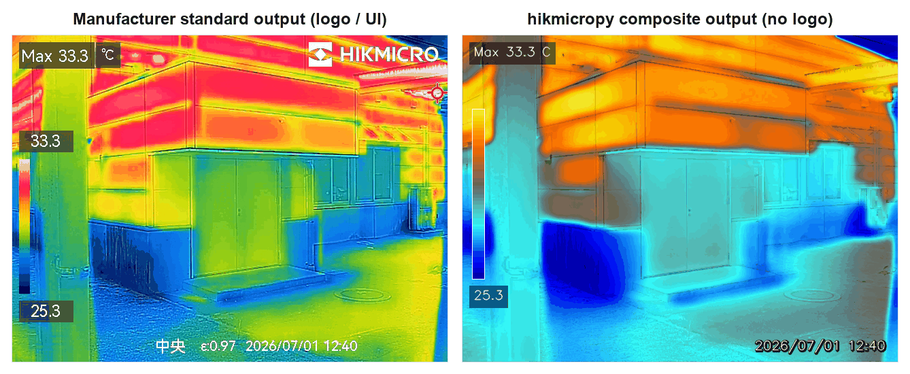
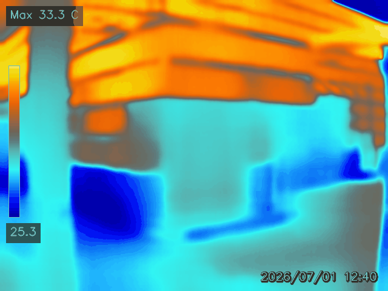
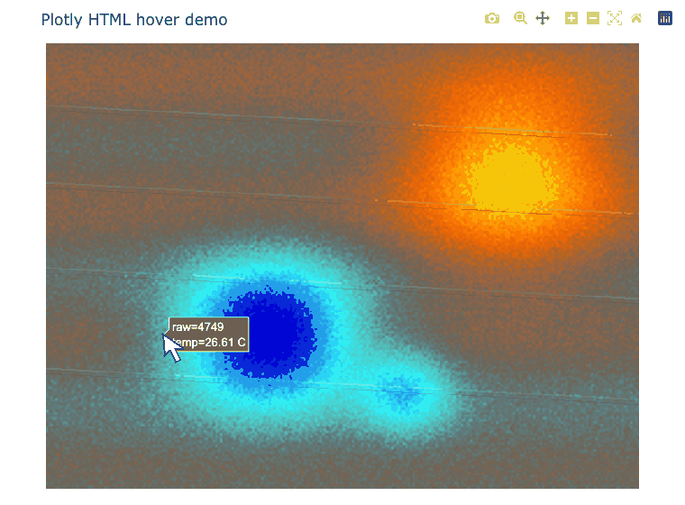
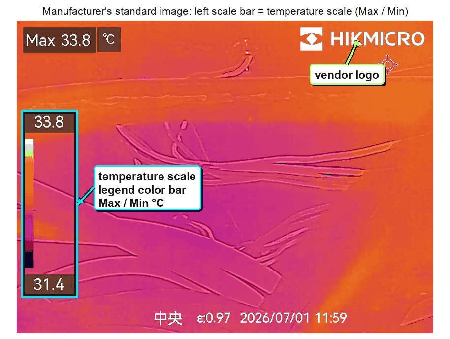

# hikmicropy

[日本語](README.md) ・ **English**

A Python package that extracts per-pixel temperature data from HIKMICRO Pocket2 radiometric
JPEG files and produces composite images and interactive temperature maps.

## Why hikmicropy

- You want to read the temperature at **any point, even after capture**.
- You do not want images that carry the **manufacturer logo**.

hikmicropy preserves the per-pixel temperature, so any point can be inspected after capture (hover
in the interactive HTML), and it outputs images free of logos and on-screen UI.

## ⚠️ Required: visible-image capture

**Before capturing, enable saving the visible image on the camera.**

Example output files

- IR image … `HM****.jpeg`
- Visible image … `HM****.VIS.jpeg`

Without it, the composite image cannot be produced.

## Overview

A `HM****.jpeg` saved by the HIKMICRO Pocket2 embeds a per-pixel raw sensor array (radiometric
data) in addition to the display image. The raw values are not temperatures on their own, so the
tool extracts them and calibrates to degrees Celsius against that image's Max / Min temperatures.
The intended use is detecting relatively cold regions on surfaces (e.g. moisture from water leaks).

## Example output

`process` **produces the visible image and the composite image as a pair**. The composite image overlays
the visible edges on the thermal color map, so structure and temperature can be read together.

Compared with the camera's own export:



The thermal-only image shows the temperature distribution, but structural boundaries are harder to
read. Overlaying structural edges from the visible image makes it easier to relate temperature
patterns to the scene.

| Visible (aligned to the IR frame) | Thermal only (color map) |
|---|---|
|  |  |

With `--html`, the package also writes a Plotly HTML view over the composite image. Hovering over the
image shows the nearest pixel's estimated temperature and raw value in a tooltip.



## Features

- Extract the **raw sensor array (256×192 `uint16`)** from the radiometric JPEG.
- Convert to °C with an **image-specific two-point linear calibration** from the scale bar.
- Align the visible image to the IR frame (scale + translation only, no rotation) and **overlay the
  structural edges**.
- **Output the visible and composite images together** (composite output requires the visible image).
- **Selectable color palettes** (default `arctic`, which renders cold/damp areas in blue).
- Export an **interactive HTML (Plotly) using the composite image as the background**, where
  **hovering over any point reports that pixel's estimated temperature and raw value**.
- Record processing metadata (calibration provenance, OCR agreement) as JSON.
- Produce output images **without any manufacturer logo**.

## Color palettes

Select with `--palette`. The default `arctic` best highlights cold (damp) regions.


## Installation

All dependencies are common to Windows, macOS, and Linux; **no platform-specific environment file
is required.**

### conda

```bash
conda env create -f environment.yml   # same file on all three OSes
conda activate hikmicropy
pip install -e .
```

### pip

```bash
pip install -e .            # core
pip install -e ".[viz]"     # + matplotlib (optional, for HikmicroExtractor.plot)
```

## Usage

```bash
# One IR/VIS pair (writes composite, visible, metadata, and HTML)
hikmicropy process IR.jpeg IR.VIS.jpeg --palette arctic --out-dir output --html

# Batch a folder (auto-pairs HM*.jpeg with HM*.VIS.jpeg)
hikmicropy batch ./photos --palette arctic --out-dir output --html

# CSV / HTML from a single IR image (no VIS; composite output is not produced)
hikmicropy export IR.jpeg --tmin 31.4 --tmax 33.8 --csv --html
```

`process` writes `*_fusion.png` (the composite image), `*_visible.png`, and `*_metadata.json` per pair, adding
`*_thermal.html` with `--html`. **A visible image (`*.VIS.jpeg`) is required to obtain the
edge-composited image**; without it, use `export` (CSV/HTML only).

## Python API

```python
from hikmicropy import HikmicroExtractor, process

ext = HikmicroExtractor("IR.jpeg")
raw = ext.get_thermal_np()                        # (192, 256) uint16
temp_c = ext.to_celsius(t_min=31.4, t_max=33.8)   # degC

process("IR.jpeg", "IR.VIS.jpeg", "output/scene01", palette="arctic", html=True)
```

## Temperature calibration

Raw values are not °C. The tool applies a **per-image two-point linear calibration** anchored to
that image's Max/Min scale bar:

```
T(°C) = t_min + (raw − raw_min) / (raw_max − raw_min) × (t_max − t_min)
```

- **Calibration must be per-image.** A single global conversion does not hold: the sensor baseline
  drifts between shots, so the same raw value maps to different temperatures across images.
- **The two anchor points match exactly, but accuracy between them is unverified.** A linear
  approximation is expected to be adequate over a few-degree span, but precise quantification
  requires known-temperature reference bodies or the vendor's per-pixel CSV.
- This is not a manufacturer-published radiometric formula.

Provide the scale via `--tmin/--tmax` (recommended) or OCR.

## Tesseract (required for OCR auto-reading)

Reading the temperature scale automatically by OCR requires the Tesseract binary.



The **temperature scale** is the legend color bar and its Max / Min values in the camera's standard
image. OCR reads this display and uses it for the two-point linear calibration from raw values to °C.

| OS | Install |
|---|---|
| Windows | `conda install -c conda-forge tesseract`, or the UB Mannheim installer |
| macOS | `brew install tesseract` |
| Linux | `apt install tesseract-ocr`, etc. |

Without Tesseract, provide the temperature scale manually with `--tmin/--tmax`. Manual input is
recommended for quantitative work. OCR assumes the **Pocket2 overlay layout** and may fail on other
models/resolutions. The recorded `ocr_confidence` is an OCR agreement ratio, not a guarantee of
temperature correctness.

## License

MIT (see `LICENSE`).
