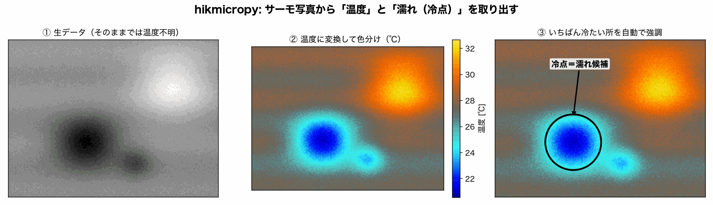
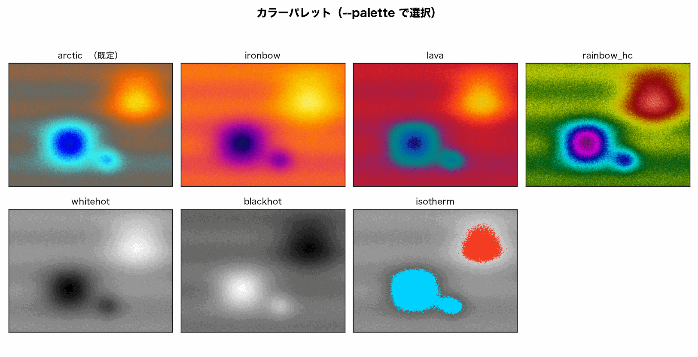

# hikmicropy

[日本語](README.md) ・ **English**

**Extract real temperatures from HIKMICRO Pocket2 thermal photos, then colorize and analyze them in Python.**

A photo taken with a HIKMICRO Pocket2 thermal camera (`HM****.jpeg`) hides a **per-pixel
temperature array** inside the file, in addition to the picture you see. `hikmicropy` recovers
it, converts it to real degrees Celsius, and produces color-mapped images and an interactive
chart you can hover to read temperatures. It is handy for tasks like water-leak inspection,
where you look for spots that are *colder than their surroundings* (i.e. damp).



## What it does (3 steps)

1. **① Extract the raw data** — read the embedded temperature array (256×192) from the JPEG. On its own it is not degrees.
2. **② Convert to temperature and colorize** — use the Max/Min °C scale bar the camera burns into the image to turn each pixel into real °C, then color it for readability.
3. **③ Highlight the cold spot** — automatically locate the coldest region (e.g. a damp/leak candidate).

## Features

- Extract the **raw thermal array (256×192 `uint16`)** from the embedded `HDRI` block.
- Convert to **real temperature (°C)** with a per-image two-point linear calibration from the scale bar.
- Crop and align the visual image to the IR frame and build a **detail-fused image** (scale + translation only; no false rotation).
- **Selectable color palettes** (default `arctic`, which shows cold/damp areas in blue).
- Export an **interactive Plotly HTML** heatmap with raw / temperature hover values.
- Write processing **metadata as JSON** (including OCR confidence).

## Color palettes

Choose the look with `--palette`. To make cold (damp) areas stand out, the default `arctic` is the clearest.



## Install

### conda

```bash
conda env create -f environment.yml
conda activate hikmicropy
pip install -e .
```

### pip

```bash
pip install -e .            # core
pip install -e ".[viz]"     # + matplotlib for HikmicroExtractor.plot()
```

### Tesseract (optional, for OCR)

Reading the burned-in scale bar with OCR needs the Tesseract binary:

```bash
brew install tesseract      # macOS
```

OCR is optional. For quantitative work, prefer passing `--tmin/--tmax` manually.

## CLI

```bash
# One IR/VIS pair
hikmicropy process IR.jpeg IR.VIS.jpeg --palette arctic --out-dir output --html

# A whole folder (auto-pairs HM*.jpeg with HM*.VIS.jpeg)
hikmicropy batch ./photos --palette arctic --out-dir output --html

# CSV / HTML from a single IR image (no VIS needed)
hikmicropy export IR.jpeg --tmin 31.4 --tmax 33.8 --csv --html
```

Outputs per image: `*_fusion.png`, `*_visible.png`, `*_metadata.json`, and (with `--html`)
`*_thermal.html`.

## Python API

```python
from hikmicropy import HikmicroExtractor, process

ext = HikmicroExtractor("IR.jpeg")
raw = ext.get_thermal_np()                        # (192, 256) uint16
temp_c = ext.to_celsius(t_min=31.4, t_max=33.8)   # degC

process("IR.jpeg", "IR.VIS.jpeg", "output/scene01", palette="arctic", html=True)
```

## Temperature calibration — read this

The raw `HDRI` values are **not** degrees Celsius. HIKMICRO computes temperature with a
proprietary radiometric model and burns the resulting scale-bar range (e.g. `31.4–33.8 °C`)
into the display image. `hikmicropy` recovers degrees with a **per-image two-point linear
calibration**, anchoring each frame to its own scale-bar `t_min/t_max`:

```
T(°C) = t_min + (raw - raw_min) / (raw_max - raw_min) * (t_max - t_min)
```

Key facts (measured):

- **Calibration must be per-image.** A single global `raw → °C` formula does **not** work: the
  raw sensor baseline drifts from shot to shot, so the same raw value maps to different
  temperatures in different frames. Re-anchoring each frame to its own scale bar absorbs that.
- **Anchors are exact; the in-between is expected-good but unmeasured.** Accuracy for pixels
  *between* the anchors (intra-image linearity) is physically expected to be excellent over a
  few-degree span but is not yet measured — it needs ≥3 known temperatures in one frame.
- This is not a manufacturer-published radiometric formula.

### Getting `t_min/t_max`

1. **Manual (recommended for quantitative use):** pass `--tmin/--tmax` read from the image.
2. **OCR (convenience):** if omitted, `hikmicropy` OCRs the burned-in scale bar. This is fitted
   to the **Pocket2 overlay layout** and may miss on other models/resolutions, in which case it
   falls back to uncalibrated raw. The recorded `ocr_confidence` is the **OCR agreement ratio**,
   not a measure of temperature correctness.

### Validating accuracy (optional)

- `hikmicropy.calibration` can compare the extracted raw against a **HIKMICRO Analyzer** per-pixel
  temperature CSV and report RMSE / max error.
- Without Analyzer, put **two known-temperature reference bodies** (e.g. ice water ≈ 0 °C and a
  measured warm object) in one frame to obtain ≥3 known temperatures and check intra-image linearity.

## Tests

```bash
pytest -q
```

Core extraction and calibration are tested against a synthetic HDRI fixture (no field images
required). OCR logic is tested with mocked candidates, so Tesseract is not needed for the suite.

## License

MIT. See `LICENSE`.
